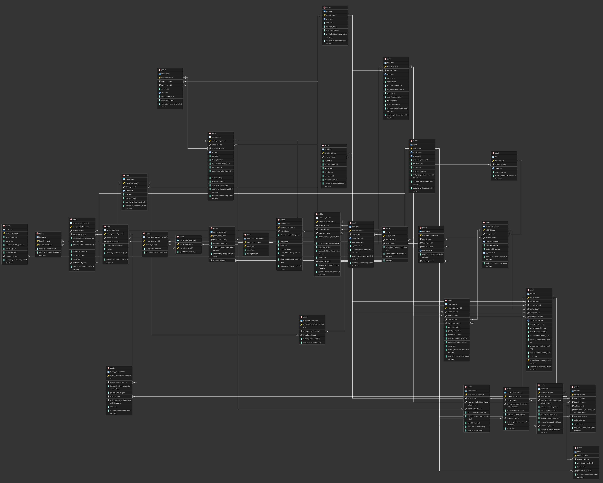

# 🍽️ Restaurant Ordering System (ROS)

Multi-tenant SaaS-платформа для управления сетями ресторанов. Один экземпляр PostgreSQL обслуживает несколько брендов (тенантов), каждому филиалу — Point-of-Sale интерфейс, управление складом и живая аналитика. Изоляция данных аппаратная — через Row-Level Security.

🇬🇧 English version: **[README.md](README.md)**

📺 **[Демо-видео](https://drive.google.com/file/d/1gIIhR5-smdk4KU7u1wavRLBfORp4vp5D/view?usp=sharing)**  ·  📝 **[Фидбек преподавателя](https://docs.google.com/presentation/d/13mfplDHew13VJOsT-ZJ5-7R0tWPaB3ib52Cf2cEfbjY/edit?usp=drive_link)**  ·  🎯 **[Презентация](presentation/Restaurant%20Ordering%20System%20%28ROS%29%20-%20Pitch%20Presentation.pdf)**  ·  🎓 **[Сертификат Oracle Academy DB](certificate_stepik/stepik-certificate-191774-27f405e.pdf)**

---

## 📋 Оглавление

- [Быстрый старт](#-быстрый-старт)
- [Архитектура](#-архитектура)
- [Демо-логины](#-демо-логины)
- [Что внутри](#-что-внутри)
- [Работа с базой](#-работа-с-базой)
- [SQL-запросы для демо](#-sql-запросы-для-демо)
- [Backup & Disaster Recovery](#-backup--disaster-recovery)
- [Документация](#-документация)
- [Чек-лист сдачи](#-чек-лист-сдачи)

---

## 🚀 Быстрый старт

```bash
git clone https://github.com/odilchon/Restaurant-Ordering-System.git
cd Restaurant-Ordering-System

cp .env.example .env       # локальные секреты (поверни JWT_SECRET если хочешь)
./run.sh                   # одна команда: Postgres + схема + seed + бекенд + фронт
```

Когда увидишь баннер **"Restaurant Ordering System — up"**, открывай:

| URL | Что это |
|---|---|
| http://localhost:3000 | **Фронтенд (Next.js дашборд)** |
| http://localhost:8000/docs | **Swagger — API браузер** |
| http://localhost:5050 | pgAdmin (admin@ros.local / admin) |

Остановить всё: `./run.sh stop`.

> **Нужен Docker.** Все сервисы в `docker-compose.yml`, `./run.sh` ими дирижирует. Запусти Docker Desktop перед стартом.

---

## 🏗️ Архитектура

```
┌───────────────────┐    ┌──────────────────────┐    ┌────────────────────────────┐
│  Next.js 14       │──▶ │  FastAPI             │──▶ │  PostgreSQL 16             │
│  Tailwind+Recharts│    │  async psycopg 3 +   │    │  RLS, партиции, MV,        │
│  светлая тема     │    │  psycopg_pool, JWT   │    │  pgcrypto, btree_gist, GIN │
└───────────────────┘    └──────────────────────┘    └────────────────────────────┘
```

**Стек:**
- **PostgreSQL 16** + расширения: `pgcrypto`, `btree_gist`, `pg_trgm`, `pg_stat_statements`, `citext`
- **FastAPI** (async) + **psycopg 3** + connection pool
- **Next.js 14** + Tailwind + Recharts (светлая тема, коралловый акцент)
- **JWT** аутентификация (24-часовые токены) + bcrypt
- **Docker Compose** для локального стека
- **GitHub Actions** CI: `sqlfluff` → применение схемы → `pytest` → backup/restore drill

### ER-диаграмма

Полная схема, отрендеренная в pgAdmin ERD Tool — 31 таблица, сгруппированная по областям: tenancy, структура ресторана, меню, склад, заказы, customer experience, аудит. Исходник в DBML: [docs/erd.dbml](docs/erd.dbml); Mermaid-версия: [docs/erd.md](docs/erd.md).



---

## 👥 Демо-логины

В системе уже два полноценных ресторанных бренда — это нужно чтобы **показать multi-tenant изоляцию**:

| Логин владельца | Пароль | Тенант | Филиалы | Стиль меню |
|---|---|---|---|---|
| `owner.alpha@demo.test` | `demo1234` | **PlovPOS Chain** | 1 (PlovPOS Bishkek Central) | Плов, манты, лагман |
| `owner.beta@demo.test` | `demo1234` | **TandyrOS** | 2 (Downtown + Джал-29) | Тандыр-самса, шашлыки, лепёшки |

**Зайди как `owner.alpha`** — увидишь только данные PlovPOS.
**Выйди, зайди как `owner.beta`** — увидишь только данные TandyrOS.
Эту изоляцию обеспечивает сам PostgreSQL через RLS-политики в [db/10_rls_policies.sql](db/10_rls_policies.sql).

---

## 📦 Что внутри

### Доменная модель — 31 таблица в 3НФ

| Область | Ключевые таблицы |
|---|---|
| Tenancy & auth | `tenants`, `users`, `user_roles` |
| Структура ресторана | `branches`, `zones`, `restaurant_tables` |
| Меню и склад | `categories`, `menu_items`, `menu_item_prices`, `menu_item_translations`, `menu_item_ingredients`, `ingredients`, `inventory`, `inventory_movements`, `suppliers`, `purchase_orders` |
| Заказы и платежи | `orders` (партиционирована по месяцам), `order_items`, `order_status_history`, `payments`, `refunds` |
| Customer experience | `reservations` (`EXCLUDE USING gist`), `loyalty_accounts`, `loyalty_transactions`, `reviews` |
| Operations & audit | `shifts`, `audit_log`, `notifications` |

### Ключевые технические решения

| Решение | Что это значит |
|---|---|
| **Row-Level Security (RLS)** | 18 таблиц защищены политиками. Один ресторан не увидит данные другого, даже если в коде бекенда будет ошибка. |
| **Партиционирование `orders`** | Помесячные RANGE-партиции по `created_at`. Запросы за неделю не сканируют 3 года истории. `ensure_orders_partition(date)` лениво создаёт новые. |
| **Materialized views** | `mv_daily_revenue_by_branch`, `mv_top_menu_items_30d` — предрассчитанная аналитика с UNIQUE индексами. `REFRESH … CONCURRENTLY` не блокирует читателей. |
| **`fn_place_order`** | Одна PL/pgSQL функция: блокирует склад `FOR UPDATE`, проверяет наличие, создаёт заказ + позиции, списывает ингредиенты. При нехватке — RAISE EXCEPTION и вся транзакция откатывается. ACID by design. |
| **`EXCLUDE USING gist`** | Таблица резерваций физически не примет пересекающиеся брони на один стол — гарантия БД, а не приложения. |
| **Generic audit trigger** | Одна PL/pgSQL функция (`fn_audit_row_change`) подвешена к 13 критическим таблицам через `TG_TABLE_NAME` + `row_to_json(OLD/NEW)` в `audit_log`. |
| **Стратегия индексов** | B-tree + partial (`WHERE status IN (…)`) + expression (`LOWER(email)`) + GIN (JSONB, tsvector) + GiST (tsrange) + BRIN на `audit_log.changed_at`. У каждого индекса свой `COMMENT`. |
| **Полнотекстовый поиск** | `menu_items.search_vector` с весами A (имя) > B (категория) > C (описание), обновляется триггером. |
| **4 роли БД** | `app_readonly` → `app_waiter` → `app_manager` → `app_admin` с наследованием и `BYPASSRLS` только у admin. |

---

## 🗃️ Работа с базой

### Подключение через `psql`

```bash
PGPASSWORD=ros_dev_password psql -h localhost -p 5433 -U ros_admin -d restaurant_ordering
```

Полезные команды psql:

| Команда | Что делает |
|---|---|
| `\dt` | Список всех таблиц |
| `\d table_name` | Структура таблицы (колонки, типы, индексы, ограничения) |
| `\di+` | Все индексы с размерами |
| `\df` | Функции |
| `\dv` / `\dm` | Обычные / материализованные представления |
| `\x on` | Вертикальный вывод (для широких таблиц) |
| `\q` | Выход |

### Подключение через pgAdmin 4

Открой http://localhost:5050 (логин `admin@ros.local` / `admin`), зарегистрируй сервер:

- **Host:** `postgres` (внутри Docker сети) или `host.docker.internal`
- **Port:** `5432` изнутри контейнера, **`5433` снаружи**
- **Database:** `restaurant_ordering`
- **Username:** `ros_admin`
- **Password:** `ros_dev_password`

В pgAdmin: правый клик на схеме `public` → **ERD Tool** → визуальная диаграмма всех таблиц.

---

## 📊 SQL-запросы для демо

> Запускай в `psql` под `ros_admin` (он обходит RLS, поэтому видишь все тенанты сразу). Бекенд для tenant-scoped запросов сам выставляет `app.current_tenant_id`.

### Системная статистика

```sql
SELECT
    (SELECT count(*) FROM tenants)    AS restaurant_chains,
    (SELECT count(*) FROM branches)   AS branches,
    (SELECT count(*) FROM menu_items) AS dishes,
    (SELECT count(*) FROM orders)     AS total_orders,
    (SELECT round(sum(total_amount))) AS lifetime_revenue_kgs
FROM tenants LIMIT 1;
```

### Выручка по тенанту по дням за 14 дней

```sql
SELECT
    t.name AS tenant,
    o.created_at::date AS day,
    count(*) AS orders,
    round(sum(o.total_amount)) AS revenue
FROM orders o
JOIN tenants t ON t.tenant_id = o.tenant_id
WHERE o.created_at >= now() - INTERVAL '14 days'
GROUP BY t.name, o.created_at::date
ORDER BY t.name, day DESC;
```

### Топ блюд через оконную функцию

```sql
SELECT branch_id, menu_item_name, revenue, revenue_rank
FROM mv_top_menu_items_30d
WHERE revenue_rank <= 5
ORDER BY branch_id, revenue_rank;
```

### Алерты по низкому остатку (живой VIEW)

```sql
SELECT * FROM v_low_stock ORDER BY shortfall DESC;
```

### Полнотекстовый поиск (показать GIN-индекс)

```sql
EXPLAIN (ANALYZE, BUFFERS)
SELECT name FROM menu_items
WHERE search_vector @@ to_tsquery('russian', 'плов | шашлык');
```

Больше запросов — в [db/queries/](db/queries/), сгруппированы по уровням сложности.

---

## 💾 Backup & Disaster Recovery

```bash
bash db/backup/backup.sh                       # ночной pg_dump (custom format, retention 7 дней)
bash db/backup/restore.sh latest               # восстановить именованный или последний бэкап
bash db/backup/disaster-recovery-drill.sh      # backup → DROP DATABASE → CREATE → pg_restore → diff row counts
```

Drill запускается в CI на каждый push. Подробнее: [docs/backup-strategy.md](docs/backup-strategy.md).

---

## 📚 Документация

| Файл | Что внутри |
|---|---|
| [docs/architecture.md](docs/architecture.md) | Архитектура и sequence-диаграммы (Mermaid) |
| [docs/erd.md](docs/erd.md) | ER-диаграмма (Mermaid — рендерится на GitHub) |
| [docs/erd.dbml](docs/erd.dbml) | Исходник ER-диаграммы (dbdiagram.io / DBML) |
| [docs/normalization.md](docs/normalization.md) | Вывод 1НФ → 2НФ → 3НФ |
| [docs/schema-description.md](docs/schema-description.md) | Описание каждой таблицы |
| [docs/transactions-demo.md](docs/transactions-demo.md) | ACID-демонстрации |
| [docs/indexing-report.md](docs/indexing-report.md) | EXPLAIN ANALYZE до и после индексов |
| [docs/backup-strategy.md](docs/backup-strategy.md) | Стратегия бэкапов |
| [docs/security.md](docs/security.md) | Безопасность, RLS, роли, JWT |
| [docs/observability.md](docs/observability.md) | Что инструментировано, trade-offs, что добавить дальше |
| [presentation/](presentation/) | Слайды презентации (PDF) |

---

## ✅ Чек-лист сдачи

- [x] ER-диаграмма ([docs/screenshots/erd.png](docs/screenshots/erd.png), исходник [docs/erd.dbml](docs/erd.dbml))
- [x] Нормализованная схема (3НФ) — [db/03_schema.sql](db/03_schema.sql)
- [x] DDL: таблицы, views, materialized views, функции, триггеры
- [x] SQL-запросы всех уровней ([db/queries/](db/queries/))
- [x] Демонстрация ACID-транзакций ([docs/transactions-demo.md](docs/transactions-demo.md))
- [x] Отчёт по индексам с EXPLAIN ANALYZE ([docs/indexing-report.md](docs/indexing-report.md))
- [x] Скрипты бэкапа, восстановления и DR-drill ([db/backup/](db/backup/))
- [x] Изоляция multi-tenant через RLS ([db/10_rls_policies.sql](db/10_rls_policies.sql))
- [x] Работающий фронтенд с интеграцией в бекенд (Next.js + FastAPI)
- [x] Слайды ([presentation/](presentation/))
- [x] **Демо-видео** → [Смотреть](https://drive.google.com/file/d/1gIIhR5-smdk4KU7u1wavRLBfORp4vp5D/view?usp=sharing)
- [x] **Фидбек преподавателя** → [Смотреть](https://docs.google.com/presentation/d/13mfplDHew13VJOsT-ZJ5-7R0tWPaB3ib52Cf2cEfbjY/edit?usp=drive_link)
- [x] **Сертификат Oracle Academy Database Course** ([certificate_stepik/](certificate_stepik/))

---

> **Лицензия:** MIT (см. [LICENSE](LICENSE))
