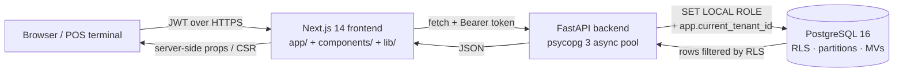
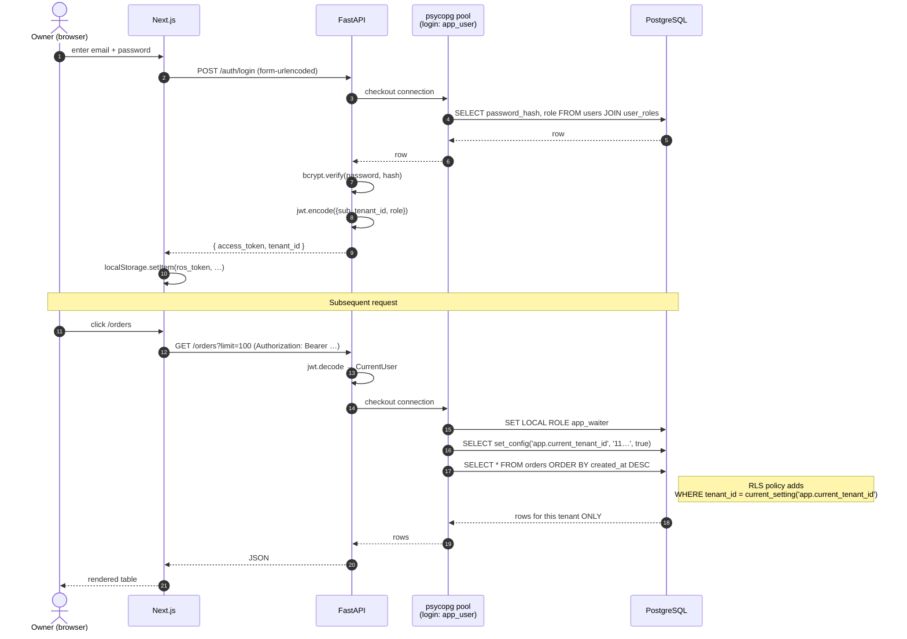
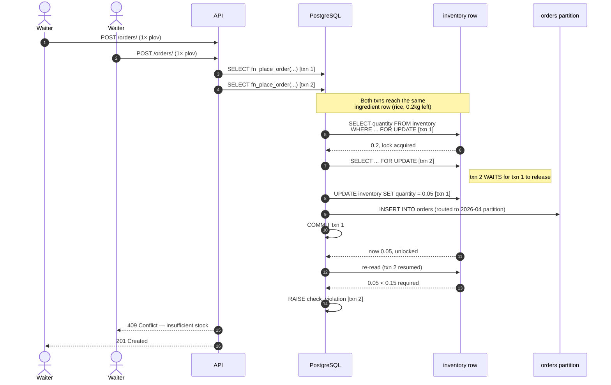
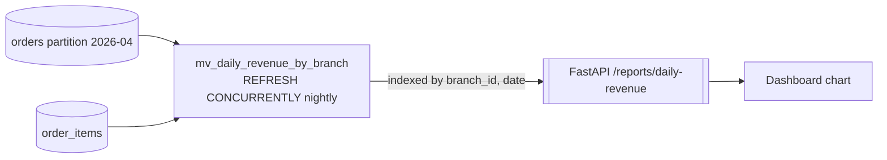
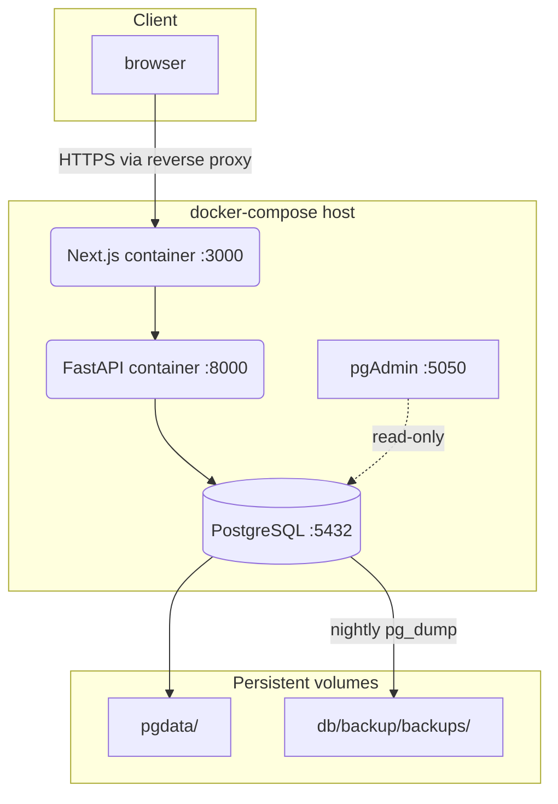

# Architecture

This document explains how the three layers of Restaurant Ordering System fit together and what each one is responsible for. The diagrams below render directly on GitHub.

## High-level components

- **Frontend** never talks to PostgreSQL directly. No DB creds ever reach the browser.
- **FastAPI** is stateless. All session state lives in the JWT (HS256, 24h TTL).
- **PostgreSQL** is the source of truth. Business rules (stock checks, totals, audit) live in PL/pgSQL so they can't be bypassed even if the API layer has a bug.

## Authentication and RLS enforcement

### Why `SET LOCAL ROLE` matters

The pool logs in as `app_user`, which has **no table grants of its own**. On every request, the backend switches to `app_waiter` / `app_manager` / `app_readonly` (per JWT role) for the duration of the transaction. If that `SET LOCAL ROLE` is ever forgotten, queries fail with `permission denied` — a loud error instead of silent data leakage.

`app_admin` has `BYPASSRLS` and is used only for migrations and the rare cross-tenant report.

## Placing an order — atomicity & locking

Key properties demonstrated here:

- **Atomicity**: `fn_place_order` inserts the order + order_items + inventory_movements in one transaction. A `RAISE` at any step rolls everything back — no half-placed orders.
- **Isolation**: `SELECT ... FOR UPDATE` prevents the classic "sell the last portion twice" race. The second writer blocks, re-reads, and correctly fails.
- **Routing via partitioning**: `orders` is `PARTITION BY RANGE (created_at)` monthly. The insert automatically lands in the right partition; queries that filter by `created_at` only scan the relevant month.

## Report path — materialized views

Dashboard queries read a pre-aggregated materialized view, not the raw `orders` table. Response times are constant no matter how many historical rows accumulate. The view has a unique index on `(branch_id, revenue_date)` so `REFRESH MATERIALIZED VIEW CONCURRENTLY` works and doesn't block readers.

## Deployment layout (recommended)

For a real deployment the reverse proxy (nginx / Caddy) terminates TLS, forwards `/` to `frontend:3000` and `/api/*` to `backend:8000`. Secrets live in environment files mounted at container start — never baked into images.
