# Entity Relationship Diagram — Restaurant Ordering System

> 31 tables, 3NF normalized, multi-tenant SaaS architecture.
> Partitioned orders, RLS policies, self-referencing categories, EXCLUDE constraints.

```mermaid
erDiagram
    %% ===== Section 1: Tenancy & Auth =====
    tenants {
        uuid tenant_id PK
        text slug UK
        text name
        jsonb settings
        boolean is_active
        timestamptz created_at
    }
    users {
        uuid user_id PK
        citext email UK
        text phone UK
        text password_hash
        text full_name
        text locale
        boolean is_active
    }
    user_roles {
        bigserial user_role_id PK
        uuid user_id FK
        uuid tenant_id FK
        uuid branch_id FK
        user_role role
    }
    sessions {
        uuid session_id PK
        uuid user_id FK
        text token_hash UK
        timestamptz expires_at
    }

    %% ===== Section 2: Restaurant Structure =====
    branches {
        uuid branch_id PK
        uuid tenant_id FK
        text code
        text name
        text address
        jsonb operating_hours
    }
    zones {
        uuid zone_id PK
        uuid branch_id FK
        text name
    }
    restaurant_tables {
        uuid table_id PK
        uuid zone_id FK
        uuid branch_id FK
        text table_number
        smallint capacity
        table_status status
    }

    %% ===== Section 3: Menu & Inventory =====
    categories {
        uuid category_id PK
        uuid tenant_id FK
        uuid parent_id FK
        text name
        text slug
    }
    menu_items {
        uuid menu_item_id PK
        uuid tenant_id FK
        uuid category_id FK
        text sku UK
        text name
        numeric base_price
        tsvector search_vector
    }
    menu_item_translations {
        uuid menu_item_id FK
        text locale
        text name
    }
    menu_item_prices {
        bigserial price_id PK
        uuid menu_item_id FK
        numeric price
        timestamptz valid_from
        timestamptz valid_to
    }
    menu_item_branch_availability {
        uuid menu_item_id FK
        uuid branch_id FK
        boolean is_available
        numeric price_override
    }
    ingredients {
        uuid ingredient_id PK
        uuid tenant_id FK
        text name
        text unit
        text_arr allergens
    }
    menu_item_ingredients {
        uuid menu_item_id FK
        uuid ingredient_id FK
        numeric quantity
    }
    inventory {
        uuid branch_id FK
        uuid ingredient_id FK
        numeric quantity
    }
    inventory_movements {
        bigserial movement_id PK
        uuid branch_id FK
        uuid ingredient_id FK
        inv_type movement_type
        numeric quantity_delta
    }
    suppliers {
        uuid supplier_id PK
        uuid tenant_id FK
        text name
    }
    purchase_orders {
        uuid purchase_order_id PK
        uuid tenant_id FK
        uuid branch_id FK
        uuid supplier_id FK
        po_status status
    }
    purchase_order_items {
        bigserial id PK
        uuid purchase_order_id FK
        uuid ingredient_id FK
        numeric quantity
    }

    %% ===== Section 4: Orders & Payments =====
    orders {
        uuid order_id PK
        uuid tenant_id FK
        uuid branch_id FK
        uuid table_id FK
        uuid waiter_id FK
        uuid customer_id FK
        text order_number
        order_status status
        timestamptz created_at PK
    }
    order_items {
        bigserial order_item_id PK
        uuid order_id FK
        uuid menu_item_id FK
        text item_name_snapshot
        numeric unit_price_snapshot
        smallint quantity
    }
    order_status_history {
        bigserial history_id PK
        uuid order_id FK
        order_status old_status
        order_status new_status
        timestamptz changed_at
    }
    payments {
        uuid payment_id PK
        uuid order_id FK
        payment_method method
        payment_status status
        numeric amount
    }
    refunds {
        uuid refund_id PK
        uuid payment_id FK
        numeric amount
        text reason
    }

    %% ===== Section 5: Customer Experience =====
    reservations {
        uuid reservation_id PK
        uuid tenant_id FK
        uuid branch_id FK
        uuid table_id FK
        text guest_name
        tstzrange reserved_period
        reservation_status status
    }
    loyalty_accounts {
        uuid loyalty_account_id PK
        uuid tenant_id FK
        uuid customer_id FK
        integer points_balance
        text tier
    }
    loyalty_transactions {
        bigserial id PK
        uuid loyalty_account_id FK
        loyalty_type transaction_type
        integer points_delta
    }
    reviews {
        uuid review_id PK
        uuid tenant_id FK
        uuid branch_id FK
        uuid order_id FK
        smallint rating
        text comment
    }

    %% ===== Section 6: Operations & Audit =====
    shifts {
        uuid shift_id PK
        uuid branch_id FK
        uuid user_id FK
        timestamptz clock_in
        timestamptz clock_out
    }
    audit_log {
        bigserial audit_id PK
        text table_name
        text row_pk
        audit_operation operation
        jsonb old_data
        jsonb new_data
    }
    notifications {
        uuid notification_id PK
        uuid user_id FK
        notification_channel channel
        text body
    }

    %% ===== Relationships =====
    tenants ||--o{ branches : "has"
    tenants ||--o{ categories : "has"
    tenants ||--o{ menu_items : "has"
    tenants ||--o{ ingredients : "has"
    tenants ||--o{ suppliers : "has"
    tenants ||--o{ orders : "has"
    tenants ||--o{ reservations : "has"
    tenants ||--o{ loyalty_accounts : "has"
    tenants ||--o{ reviews : "has"
    tenants ||--o{ purchase_orders : "has"

    users ||--o{ user_roles : "has"
    users ||--o{ sessions : "has"
    users ||--o{ shifts : "works"
    users ||--o{ notifications : "receives"

    branches ||--o{ zones : "contains"
    branches ||--o{ restaurant_tables : "has"
    branches ||--o{ orders : "receives"
    branches ||--o{ inventory : "stocks"
    branches ||--o{ inventory_movements : "logs"
    branches ||--o{ reservations : "accepts"
    branches ||--o{ purchase_orders : "orders from"
    branches ||--o{ reviews : "gets"

    zones ||--o{ restaurant_tables : "contains"

    categories ||--o{ categories : "parent"
    categories ||--o{ menu_items : "groups"

    menu_items ||--o{ menu_item_translations : "translated"
    menu_items ||--o{ menu_item_prices : "price history"
    menu_items ||--o{ menu_item_branch_availability : "available at"
    menu_items ||--o{ menu_item_ingredients : "recipe"
    menu_items ||--o{ order_items : "ordered as"

    ingredients ||--o{ menu_item_ingredients : "used in"
    ingredients ||--o{ inventory : "stocked"
    ingredients ||--o{ inventory_movements : "moved"
    ingredients ||--o{ purchase_order_items : "purchased"

    suppliers ||--o{ purchase_orders : "fulfills"
    purchase_orders ||--o{ purchase_order_items : "contains"

    orders ||--o{ order_items : "contains"
    orders ||--o{ order_status_history : "tracked"
    orders ||--o{ payments : "paid by"

    payments ||--o{ refunds : "refunded"

    loyalty_accounts ||--o{ loyalty_transactions : "logs"
```

